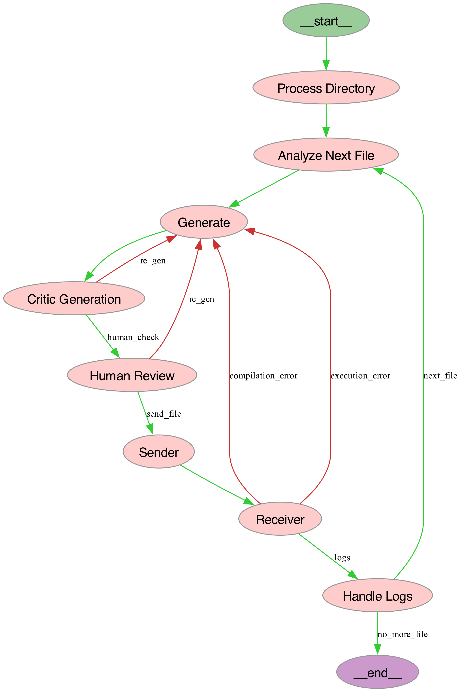

# COBOL Enhancer

## Overview

COBOL Enhancer is a Python-based tool designed to optimize COBOL code. Using the power of AI, it refactors COBOL code to be more efficient and error-free while maintaining the original functionality and structure of the code.

## Quick Start
> Anything-LLM, DAnswer, Dify, FastGPT, GenAI-Stack, Quivr 
### Prerequisites

- Python 3.9+
- Poetry for dependency management
- Direnv for environment variable management

### Installation

1. Clone the repository from GitHub:
    ```bash
   git clone https://github.com/thibaudbrg/cobol_enhancer.git
    ```
3. Navigate to the cloned repository directory:
    ```bash
   cd cobol_enhancer
    ```
   4. Install dependencies using Poetry:
    ```bash
   poetry install
    ```

### Environment Setup

1. Create a `.env` file by copying the `.env.example` template:
    ```bash
   cp .env.example .env
    ```
2. Fill in your Langchain and OpenAI API keys in the `.env` file.
3. Load the environment variables:
    ```bash
   eval "$(direnv hook bash)" direnv allow
    ```

### Running the Application

1. Start the Langchain server:
    ```bash
    langchain serve
    ```
2. Run the tests for the `cobol_enhancer` workflow:
    ```bash
   poetry add pytest --group dev poetry run python -m pytest packages/ubp-cobol/tests/test_chain.py::test_workflow -s
    ```
3. To display a side-by-side comparison of the old and new COBOL code:
    ```bash
   poetry run python -m pytest packages/ubp-cobol/tests/test_chain.py::test_print_workflow -s
    ```

## Program Workflow

The `cobol_enhancer` application is designed to iteratively improve a directory of COBOL code files using an AI-based language model (LLM). The process flow is as follows:

1. **Input**: The program takes a directory containing COBOL code files as its input.

2. **Enhancement**: Each COBOL file is passed through the LLM, which refactors the code to improve efficiency, readability, and adherence to modern coding practices while preserving the original functionality and structure.

3. **Human Review**: After an enhancement is suggested by the LLM, a human reviewer is prompted to either accept the changes or provide specific feedback for further refinement.

4. **Iterative Generation**: Based on the human reviewer's feedback, the LLM re-attempts to enhance the code. This loop continues until the reviewer is satisfied with the enhancements.

5. **Completion**: Once the code is approved by the human reviewer, it is deemed finalized, and the program proceeds to the next COBOL file in the directory.


Below is a visual representation of the workflow within `cobol_enhancer`:

<p align="center">
  
</p>

## License

Distributed under the MIT License. See `LICENSE` for more information.
